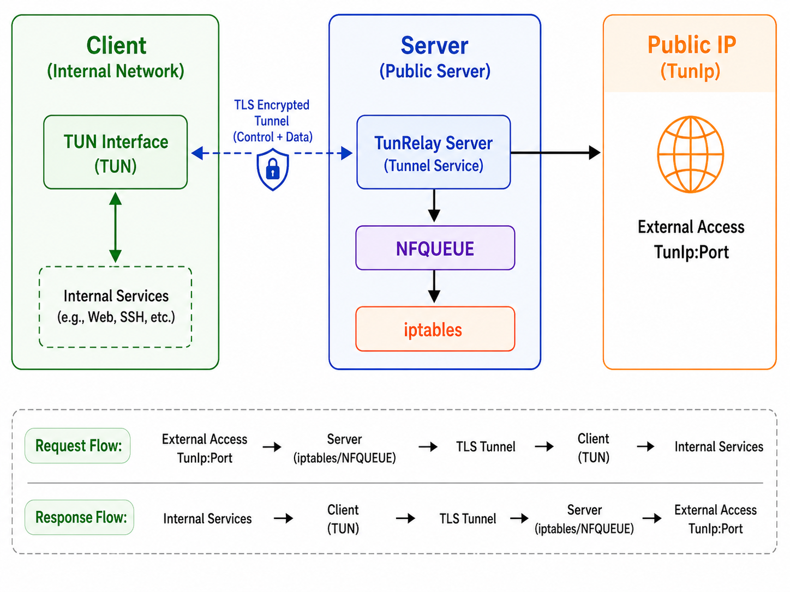

# TunRelay

TunRelay is a lightweight intranet tunneling solution. It creates an IP-level
forwarding path between a Linux server and an internal Windows/Linux client,
then exposes selected TCP/UDP service ports through an encrypted tunnel.

The server runs on Linux with NFQUEUE/iptables. The client runs on Windows or
Linux with a TUN adapter.

## Features

- TLS encrypted client/server tunnel
- HMAC-SHA256 client authentication
- One-time client credential provisioning
- Windows client based on Wintun
- Linux client based on `/dev/net/tun`
- Linux server based on `iptables` and `libnetfilter_queue`
- Separate TCP and UDP forwarded port configuration
- Server-controlled TUN IP and forwarded port delivery
- Batched data channel with runtime tunnel statistics
- Parallel data connections with stable per-flow routing
- Startup command-line overrides for common runtime settings
- Configurable console log level, including runtime client log-level changes
- Windows/Linux x64/arm64 TUN support with runtime `epoll_event` layout detection

## Requirements

### Server

- Linux
- Root privileges
- `iptables`
- `libnetfilter_queue`

Example Debian/Ubuntu dependencies:

```bash
sudo apt install iptables libnetfilter-queue1
```

### Client

- Windows or Linux
- Administrator/root privileges
- Windows: `wintun.dll` next to the client executable
- Linux: `/dev/net/tun` and the `ip` command from `iproute2`

## Quick Start

### 1. Get Binaries

For normal use, download a release binary from
[Releases](https://github.com/hushfox37/TunRelay/releases).

Common artifact names:

- Server on Linux x64: `tunrelay-server-linux-x64`
- Client on Windows x64: `tunrelay-client-win-x64`
- Client on Linux x64: `tunrelay-client-linux-x64`
- Client on Linux ARM64: `tunrelay-client-linux-arm64`

The published binaries are self-contained. You do not need to install the .NET
runtime on the target machine.

For Linux x64, if the target machine has an older glibc, build on that target
machine or on a compatible older Linux system.

### 2. Address Model



The most important fields are:

| Field | Meaning |
| --- | --- |
| `ServerIP` | Address used for the server TLS certificate. Usually the server public IP or DNS name. |
| `ListenPort` | Server control/data listening port. The client connects to this port. |
| `TunIp` | The server physical NIC IP or real service-side IP that should be exposed through the tunnel. The server sends this value to the client, and the client configures its TUN side with it. |
| `TcpPorts` / `UdpPorts` | Service ports that the server captures and forwards through the tunnel. |
| `ServerIp` | Client-side address used to connect to the server. |
| `ServerPort` | Client-side control/data port; normally matches server `ListenPort`. |

Traffic from the client machine to `<TunIp>:<forwarded-port>` goes through the
tunnel and reaches the corresponding service-side port handled by the server.

### 3. Configure Credentials

Both programs read `config.json` from their current working directory. If the
file does not exist, it is created with default values; edit it and restart the
program.

The normal authentication path uses `ClientID` plus `Secret`.

Recommended first-time setup:

1. Put the server address and port in the client `config.json`.
2. Leave the client `Secret` empty. If `ClientID` is empty, the client generates
   one and writes it to `config.json`.
3. Start the server and enable one-time automatic credentials.
4. Start the client. The server writes the client's `ClientID` and the generated
   `Secret` to `Server/config.json`; the client writes the received `Secret` to
   `Client/config.json`.
5. The server automatically disables automatic credentials after success.

Enable automatic credentials for this run at server startup:

```bash
sudo ./TunRelayServer --AutoCredentials
```

or:

```bash
sudo ./TunRelayServer --auto-credentials
```

You can also enable it from the server interactive shell:

```text
autocred on
```

Automatic credentials are a runtime-only switch. The values written to config
are `ClientID` and `Secret`.

### 4. Start The Server

Run the server as root:

```bash
sudo ./TunRelayServer
```

### 5. Start The Client

Run the Windows client as Administrator:

```powershell
.\TunRelayClient.exe
```

Run the Linux client as root:

```bash
sudo ./TunRelayClient
```

### 6. Verify Connectivity

From the client machine, connect to the server-side address and forwarded port:

```bash
iperf3 -c <TunIp> -p <forwarded-port>
```

For reverse mode:

```bash
iperf3 -c <TunIp> -p <forwarded-port> -R
```

Where:

- `<TunIp>` is the server `TunIp` value.
- `<forwarded-port>` is one of the ports in server `TcpPorts`.

Use `stats reset` on both sides before a benchmark so the displayed throughput
matches the test interval.

## Configuration Reference

### Server `config.json`

```json
{
  "ServerIP": "203.0.113.10",
  "ListenPort": 19192,
  "TunIp": "server-physical-nic-ip",
  "TcpPorts": [19191],
  "UdpPorts": [],
  "ClientID": "client-id-from-client-config",
  "Secret": "shared-secret",
  "LogLevel": "Information",
  "BatchDelayMs": 1,
  "MaxBatchBytes": 65536,
  "MaxBatchPackets": 32,
  "UplinkConnections": 4,
  "DownlinkConnections": 4
}
```

Fields:

- `ServerIP`: server address used in the generated TLS certificate
- `ListenPort`: tunnel listening port
- `TunIp`: server physical NIC IP or real service-side IP exposed through the
  tunnel; the client configures its TUN side with the value sent by the server
- `TcpPorts`: TCP service ports forwarded through the tunnel
- `UdpPorts`: UDP service ports forwarded through the tunnel
- `ClientID`: client identifier allowed to authenticate
- `Secret`: shared HMAC secret
- `LogLevel`: minimum console log level, for example `Information` or `Trace`
- `BatchDelayMs`: packet batching wait window in milliseconds
- `MaxBatchBytes`: maximum encoded packet bytes per batch
- `MaxBatchPackets`: maximum packets per batch
- `UplinkConnections`: client-to-server data connection count
- `DownlinkConnections`: server-to-client data connection count

If `Secret` is empty, the server generates one and writes it to `config.json`.
Without automatic credentials enabled, the server exits after generating it so
you can copy the value to the client config manually.

### Client `config.json`

```json
{
  "ServerIp": "203.0.113.10",
  "ServerPort": 19192,
  "ClientID": "generated-client-id",
  "Secret": "shared-secret",
  "LogLevel": "Information",
  "BatchDelayMs": 1,
  "MaxBatchBytes": 65536,
  "MaxBatchPackets": 32,
  "ReconnectDelayMs": 5000,
  "MaxReconnectAttempts": 0
}
```

Fields:

- `ServerIp`: server address
- `ServerPort`: server tunnel port
- `ServerPorts`: optional legacy alias for `ServerPort`; if present, it takes
  precedence over `ServerPort`
- `ClientID`: generated automatically and saved if empty
- `Secret`: shared HMAC secret; if empty, the client requests one-time automatic
  credentials from the server
- `LogLevel`: minimum console log level, for example `Information` or `Trace`
- `BatchDelayMs`: packet batching wait window in milliseconds
- `MaxBatchBytes`: maximum encoded packet bytes per batch
- `MaxBatchPackets`: maximum packets per batch
- `ReconnectDelayMs`: reconnect delay in milliseconds
- `MaxReconnectAttempts`: maximum reconnect attempts; `0` means unlimited

### Startup Overrides

Command-line options override the loaded config for the current run. They are
not saved, except when the program explicitly provisions credentials or
generates a missing client ID.

Server options:

```text
--AutoCredentials [true|false]
--auto-credentials [true|false]
--ServerIP <ip-or-host>
--server-ip <ip-or-host>
--ListenPort <port>
--listen-port <port>
--TunIp <ip>
--tun-ip <ip>
--TcpPorts <port[,port...]>
--tcp-ports <port[,port...]>
--UdpPorts <port[,port...]>
--udp-ports <port[,port...]>
--ClientID <id>
--client-id <id>
--Secret <secret>
--secret <secret>
--LogLevel <level>
--log-level <level>
--UplinkConnections <count>
--uplink-connections <count>
--DownlinkConnections <count>
--downlink-connections <count>
--BatchDelayMs <ms>
--batch-delay-ms <ms>
--MaxBatchBytes <bytes>
--max-batch-bytes <bytes>
--MaxBatchPackets <count>
--max-batch-packets <count>
```

Client options:

```text
--ServerIP <ip-or-host>
--server-ip <ip-or-host>
--ServerPort <port>
--server-port <port>
--ClientID <id>
--client-id <id>
--Secret <secret>
--secret <secret>
--LogLevel <level>
--log-level <level>
--ReconnectDelayMs <ms>
--reconnect-delay-ms <ms>
--MaxReconnectAttempts <count>
--max-reconnect-attempts <count>
--BatchDelayMs <ms>
--batch-delay-ms <ms>
--MaxBatchBytes <bytes>
--max-batch-bytes <bytes>
--MaxBatchPackets <count>
--max-batch-packets <count>
```

## Runtime Shell

When standard input is interactive, both programs provide a small console shell.

Server commands:

```text
stats
stats reset
autocred on
autocred off
autocred status
help
```

Client commands:

```text
status
config
loglevel <level>
stats
stats reset
help
```

Watch `channelDrops`, `protocolErrors`, and `sinkWriteFailures`; they should
remain `0` during a healthy run.

## Tuning

### Batch Tuning

Batch settings must be configured on both the client and server. Values are
normalized at startup:

- `BatchDelayMs`: `0` to `3`
- `MaxBatchBytes`: `4096` to `262144`
- `MaxBatchPackets`: `1` to `128`

The default values are conservative:

```json
{
  "BatchDelayMs": 1,
  "MaxBatchBytes": 65536,
  "MaxBatchPackets": 32
}
```

### Parallel Connections

The server controls the number of data connections and sends those values to
the client during the control handshake. `UplinkConnections` and
`DownlinkConnections` are normalized to `1` through `16` at runtime.

Packets are assigned to a data connection with a stable IPv4 5-tuple flow hash
so packets from the same TCP/UDP flow stay on the same connection.

## Troubleshooting

- `Connection refused`: check that the server is listening, `ServerPort`
  matches `ListenPort`, the firewall allows the port, and data connections are
  not being refused.
- Authentication failed: check that `ClientID` and `Secret` match. For first
  setup, enable automatic credentials with `--AutoCredentials` or `autocred on`.
- Disconnects after startup: check `stats` on both sides, especially
  `protocolErrors`, `sinkWriteFailures`, and `channelDrops`.
- `GLIBC_x.xx not found`: the target machine glibc is too old. Build on the
  target machine or on a compatible older Linux system.
- Linux permission errors: the server needs root plus `iptables` and
  `libnetfilter_queue`; the Linux client needs root plus `/dev/net/tun`.
- Windows client startup errors: run as Administrator and put `wintun.dll` next
  to the client executable.

## Build From Source

Install the .NET 10 SDK before building from source.

```bash
dotnet build Client/TunRelayClient.csproj
dotnet build Server/TunRelayServer.csproj
```

On Windows PowerShell:

```powershell
dotnet build Client\TunRelayClient.csproj
dotnet build Server\TunRelayServer.csproj
```

Publish self-contained single-file binaries:

```bash
dotnet publish Client/TunRelayClient.csproj -c Release -r linux-x64 --self-contained true -p:PublishSingleFile=true -p:DebugType=none -p:DebugSymbols=false
dotnet publish Client/TunRelayClient.csproj -c Release -r linux-arm64 --self-contained true -p:PublishSingleFile=true -p:DebugType=none -p:DebugSymbols=false
dotnet publish Server/TunRelayServer.csproj -c Release -r linux-x64 --self-contained true -p:PublishSingleFile=true -p:DebugType=none -p:DebugSymbols=false
```

On Windows PowerShell:

```powershell
dotnet publish Client\TunRelayClient.csproj -c Release -r win-x64 --self-contained true -p:PublishSingleFile=true -p:DebugType=none -p:DebugSymbols=false
dotnet publish Client\TunRelayClient.csproj -c Release -r linux-x64 --self-contained true -p:PublishSingleFile=true -p:DebugType=none -p:DebugSymbols=false
dotnet publish Server\TunRelayServer.csproj -c Release -r linux-x64 --self-contained true -p:PublishSingleFile=true -p:DebugType=none -p:DebugSymbols=false
```

Published files are written under `bin/Release/net10.0/<runtime>/publish/`.

Native AOT cannot be cross-compiled between platforms. Build in the matching
platform environment.

## Repository Layout

```text
Client/   Windows/Linux client
Server/   Linux server
licenses/ Third-party license texts
```

## Notes

- The server adds iptables rules while running and removes them on shutdown.
- Stop the server with `Ctrl+C` when possible so cleanup handlers can run.
- The Windows client creates a Wintun adapter and configures the TUN IP sent by
  the server.
- The Linux client creates a TUN device named `Tunnel` and configures the TUN IP
  sent by the server.
- This project does not distribute Linux `iptables` or `libnetfilter_queue`;
  they must be installed on the target system.

## License

This project is licensed under the Apache License 2.0. See `LICENSE`.

Third-party notices are listed in `THIRD-PARTY-NOTICES.md`.
